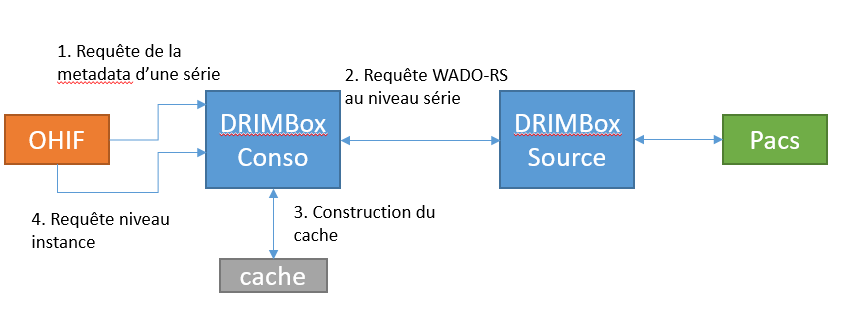

# DRIMbox

Ce code constitue un démonstrateur de la DRIMbox. 
Il ne prend pas en charge l'intégralité des specifications et des exigences. Il s'intéresse principalement à l'interface de consultation des documents disponibles sur le DMP et à l'affichage des images par l'intermédiaire du viewer OHIF. Ce démonstrateur a été testé sur un environnement DMP de test de la CNAM.

Ce démonsrateur est livré tel quel et ne fera pas l'objet de support. 

Certaines modifications pourront être apportées ponctuellement.

Le projet est séparé en plusieurs parties: 
- frontendRisConso : application Angular en JavaScript et TypeScript pour simuler le RIS/DPI appelant la DRIMbox Conso
- frontendConso : application Angular en JavaScript et TypeScript pour l'interface de la DRIMbox Conso
- frontendSource : application Angular en JavaScript et TypeScript pour l'interface de la DRIMbox Source
- backend : application Quarkus en Java pour le backend de la DRIMbox Conso et Source

## Compilation & lancement

### Front-end RIS Conso

Prérequis :
- [Node.js](https://nodejs.org/en/) (version 16.xx LTS)
- [Yarn](https://yarnpkg.com/getting-started/install)

Puis, dans le répertoire **frontendRisConso** faire :

```bash
yarn install
yarn start
```

### Front-end Conso

Prérequis :
- [Node.js](https://nodejs.org/en/) (version 16.xx LTS)
- [Yarn](https://yarnpkg.com/getting-started/install)

Puis, dans le répertoire **frontendConso** faire :

```bash
yarn install
yarn start
```


L'IDE [Visual Studio Code](https://code.visualstudio.com/) a été utilisé pour le code d'exemple. Une version sans télémetrie est également disponible [ici](https://github.com/VSCodium/vscodium).

### Front-end Source

Prérequis :
- [Node.js](https://nodejs.org/en/) (version 16.xx LTS)
- [Yarn](https://yarnpkg.com/getting-started/install)

Puis, dans le répertoire **frontendSource** faire :

```bash
yarn install
yarn start
```
L'IDE [Visual Studio Code](https://code.visualstudio.com/) a été utilisé pour le code d'exemple. Une version sans télémetrie est également disponible [ici](https://github.com/VSCodium/vscodium).

### Back-end

Prérequis :

- [Quarkus](https://quarkus.io/get-started/) (si Java n'est pas installé, Quarkus se chargera de l'installer pour vous)
- [Maven](https://maven.apache.org/install.html)


Puis dans le répertoire **backend** faire :

```bash
./mvnw compile quarkus:dev -Dquarkus.args=source
```
ou
```bash
./mvnw compile quarkus:dev -Dquarkus.args=conso
```
L'argument passé avec `-Dquarkus.args` permet de définir au lancement s'il s'agit d'une DRIMbox Conso ou Source

L'IDE [IntellIJ IDEA Communinty](https://www.jetbrains.com/fr-fr/idea/download/) a été utilisé pour le code d'exemple.

> **NOTE**
>
> Des scripts docker-compose sont également disponible sous le dossier `docker`


## DRIMbox Conso vs DRIMbox Source

Le back-end contient à la fois le code de la DRIMbox Conso et de la DRIMbox Source. 

Pour la récupération des images, la DRIMbox Conso interroge la DRIMbox Source, qui est reliée au PACS Source. La DRIMbox Conso possède un système de cache lui évitant de faire des requêtes inutiles.

Chaque type de DRIMbox est implémenté dans une seule classe : 

|   | DRIMbox Conso | DRIMbox Source |
| :- |:-------------:| :----------------:|
| **Classe**  |   `DbConsoRequest.java`        |  ` DbSourceRequest.java` |
| **Préfixe d'API**  | `/rs`, `/wado`, `/ohifmetdata`    |  `/drimbox`  |
| **Authentification**  |   `Cookie-ID`        |  `Introspection PSC` |


## Note d'implementation

### Pro Santé Connect (PSC)

Le front-end génère un cookie de session appelé `SessionToken` permettant de s'identifier sur le back-end. Le back-end fait les appels à Pro Santé Connect et renvoie l'état de la connection au front-end.

Si les tokens associés aux cookies ne sont plus valides (expiration par exemple), le back-end renverra sur la page Pro Santé Connect afin de se réidentifier.

Votre client ID et le votre secret doivent être rempli dans `Backend\src\resources\application.properties` : 
- Client ID : `quarkus.oidc.client-id` 
- Secret : `quarkus.oidc.credentials.secret`


Lors de l'enregistrement à Pro Santé Connect, une url de redirection sera demandée. 


Elle est à renseigner dans `Backend\src\resources\application.properties` au niveau de la propriété `ris.host`. Cette url correspond à l'url ou va tourner le `FrontendRis`.

Par exemple si vous avez renseigné `https://localhost` il faudra configurer le FrontendRis comme cela : 

 ```json
 //....
 "serve": {
   "builder": "@angular-devkit/build-angular:dev-server",
      "options": {
       "ssl": true, 
       "sslCert": "my_cert.pem",
       "sslKey": "my_key.pem",
       "port": 443
  },
 //...
```

et mettre la propriété `ris.host` à `https://localhost`. Vous pouvez également spécifier le port dans la configuration angular.


### Authentification avec OHIF


Une version personalisée d'OHIF est utilisée et se charge de transmettre notre cookie d'authentification au back-end. (Utiliser la branche develop du dépôt https://github.com/ansforge/DIM_OHIF)

Le code responsable de cette action peut être trouvé ici  : `platform\viewer\src\config.js`

Cette fonction retourne notre cookie s'il est présent dans le header de chaque requête, ce qui permet au back-end de savoir si on est authentifié.


    OHIF.user.getAccessToken = () => {

    // Access token is our cookie ID
    const cookieID = ('; ' + document.cookie).split(`; SessionToken=`).pop().split(';')[0];
    if (cookieID) {
      return cookieID;
    }

    // TODO: Get the Redux store from somewhere else
    const state = window.store.getState();
    if (!state.oidc || !state.oidc.user) {
      return;
    }

    return state.oidc.user.access_token;
  };


> **NOTE**
>
> Il est important pour que le cookie soit bien transféré, que le front-end et le viewer tourne sur la même IP (`localhost:433` et `localhost:3000` par exemple). 
>  
> **Attention** : `127.0.0.1:433` et `localhost:3000` ne marcheront pas, il faut que le nom de domaine soit **strictement** le même.


### Authentification vers le DMP

Les certificats doivent être placés dans `Backend\src\main\resources\dmp` :

- `auth.p12` le certificat d'authentification
- `signature.p12` le certificat de signature du VIHF

Vos certificats doivent être générés avec le type `ORG`. Les certificats associés à un personnel de santé (`PS`) ne marcheront pas.

L'objet du certifcat doit contenir un champ `OU`, qui n'est pas présent dans un certifcat `PS`

- Valide : `CN=DRIMbox, OU=499700367909006, O=CABINET M DOC0036790, ST=Paris (75), C=FR`
- Invalide : `CN=899700367917 + SURNAME=MAXIMAXIMAXIMAXIMAXI0036791 + GIVENNAME=MUMUMUMUMUMUMUMUMUMUMUMUMUM, T=Médecin, C=FR`

Le mot de passe des certificats doit être indiqué dans le fichier `Backend\src\resources\application.properties` :

La propriété `dmp.auth.certif.password` doit être associée au mot de passe utilisé pour les fichiers p12.

> NOTE : 
>
> Un certificat de confiance est nécessaire pour se connecter au DMP. Nous avons utilisé `ACI-EL-ORG.crt` dans ce code d'exemple. La liste des certificats est disponible ici : http://igc-sante.esante.gouv.fr/PC/
> 
> Java ne permet pas d'utiliser les certificats en l'état qui doivent être incorporés dans un keystore (.jks).  Pour générer votre keystore (dans le répertoire `Backend/src/main/resources/dmp/authClient-truststore.jks` ), les instructions sont disponibles sur le header de la classe `DMPKeyStore.java`. 
> Un mot de passe est nécessaire pour l'accès à ce keystore. Il est à renseigner en clair dans le fichier `Backend\src\resources\application.properties`  (propriété `dmp.auth.store.password`)
>      


### Cache des images dicom

Pour éviter de faire trop de requêtes, un système de cache a été mis en place au niveau de la DRIMbox Conso.

Le cache utilise les types `Uni` de `mutiny` pour ne pas bloquer les requêtes ainsi que des `Future`. 



Une requête niveau Série est faite à la DRIMbox Source, qui renvoie toutes les images associées à la DRIMbox Conso. OHIF va demander toutes les images, instance par instance, à la DRIMbox Conso, qui va répondre avec les images du cache.

Tout se fait de façon asyncrhone afin de pas bloquer le reste du back-end.

> NOTE
> Pour l'instant nous rencontrons des limitations dues à OHIF qui effectue les requêtes 2 par 2, ce qui ralenti l'affichage des images la première fois. 
> 
> Des modifications devront être apportées à l'extention Conerstone qui est en charge des requêtes et de l'affichage des images afin de changer cette limitation.
>
> Par ailleurs, des travaux sont toujours en cours pour optimiser la gestion de la requête multipart/related au niveau de la DRIMbox Source et Conso.


### Configuration du Pacs dans la DRIMbox Source

A ce jour, le Pacs Source tourne sur la même machine que la DRIMbox Source.

Plusieurs configurations sont nécessaires dans le fichier `Backend\src\resources\application.properties` afin de réaliser la connexion entre la DRIMbox et le Pacs.


La propriété `dcm.cstore.host` défini l'adresse IP sur laquelle la drimbox source va écouter. `0.0.0.0` ou `127.0.0.1` peut marcher en environement de developement, mais une adresse IP devra être assignée pour un environement de production.

La propriété `dcm.cstore.AET` correspond à l'AETITLE du CStoreSCP de la DRIMbox Source et configuré dans le Pacs Source avec l'IP de `dcm.cstore.host` et le port de `dcm.cstore.port`.

La propriété `dcm.cmove.calledAET` correspond à l'AETITLE de votre Pacs Source.

La propriété `dcm.cmove.port` correspond au port de votre Pacs Source.

La propriété `dcm.cmove.callingAET` correspond à l'AETITLE du CMoveSCU de la DRIMbox Source et configuré dans le Pacs Source avec l'IP de `dcm.cstore.host` et le port `104`.

Vous devrez également créer un AET dans le pacs. Pour dcm4chee il vous faudra créer (e.g. : http://localhost:8080/dcm4chee-arc/ui2/#/device/aelist) un AETitle avec le nom contenu dans `dcm.cstore.AET` avec l'ip de la machine sur laquelle la drimbox source écoute. Notez qu'il faudra renseigner l'IP de la drimbox source et que le `127.0.0.1` ou `localhost` ne marcheront pas.


### Configuration du Pacs dans la DRIMbox Conso

Aujourd'hui, l'export vers le Pacs de la DRIMbox Conso se fait via un lien DICOMWeb.
Ce lien est paramétrable avec la propriété `pacs.stowUrl` au niveau du fichier `Backend\src\resources\application.properties`.


## Erreurs courantes

### "No route to host" pendant le C-MOVE

Le message suivant peut apparaître lors du C-MOVE (DRIMbox source) :

```
 LOCAL->DCM4CHEE(3) >> 1:C-MOVE-RSP[pcid=1, status=a702H, errorComment=java.net.NoRouteToHostException: No route to host (Host unreacha
  tsuid=1.2.840.10008.1.2 - Implicit VR Little Endian]
```

Ce message est du à une mauvaise configuration du PACS et de l'aelist. Voir la section configuration de la DRIMbox source et assurez vous que l'AET et le port soit bien renseignés dans le pacs.

## Contact

Pour toute information complémentaire, merci de contacter guillaume.pasquier@b-com.com et ans-forge@esante.gouv.fr

